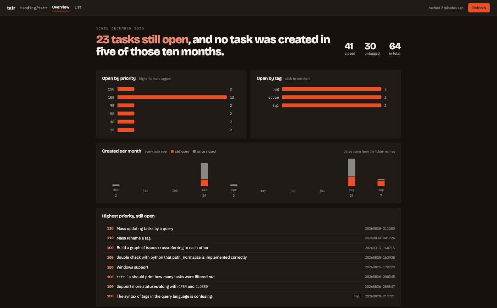
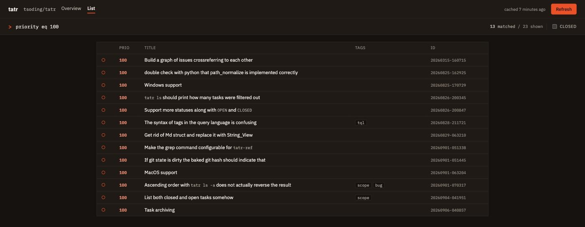
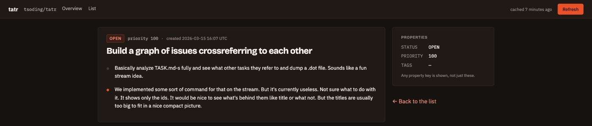

<div align="center">

# tatr dashboard

**Any repository's `tasks/` folder, read like an issue tracker.**<br>
In the browser. No server, no backend, no clone.

[**Open it →**](https://github.broutin.dev/tatr-dashboard) &nbsp;·&nbsp;
[Watch it read its own backlog](https://github.broutin.dev/tatr-dashboard/yakanet/tatr-dashboard) &nbsp;·&nbsp;
[What is tatr?](https://github.com/tsoding/tatr)

[](https://github.com/yakanet/tatr-dashboard/actions/workflows/deploy.yml)

</div>



<div align="center"><sub>Reading <a href="https://github.com/tsoding/tatr"><code>tsoding/tatr</code></a> — 64 tasks, the repository the test fixtures are taken from.</sub></div>

## Your tasks already live in git. Now you can see them.

[tatr](https://github.com/tsoding/tatr) keeps every task as a folder —
`tasks/20260315-160715/TASK.md` — holding a few `- KEY: value` lines and
free-form Markdown. It is a genuinely good idea: no database, no lock file,
tasks move with the branch, and a change to one shows up in a diff.

It stops being enough the moment somebody asks *what is actually left?*

Paste a repository name. That is the entire setup.

## Every view is a link

The repository *is* the route, so anything you are looking at can be sent to
someone else and land them exactly there.

| URL | Shows |
| --- | --- |
| `/yakanet/tatr-dashboard` | the dashboard for `github.com/yakanet/tatr-dashboard` |
| `/yakanet/tatr-dashboard@main` | the same repository, pinned to a branch by name |
| `/yakanet/tatr-dashboard/list?q=:ui` | the task list, filtered |
| `/yakanet/tatr-dashboard/task/20260906-211234` | one task, rendered |
| `/yakanet/tatr-dashboard/graph` | which tasks cite which |

Nothing to sign in to, nothing to configure, no repository to register first.

It answers the keyboard throughout: `j`/`k` walk whatever the view is showing —
rows, bars, graph nodes — `g g` and `G` reach the ends, `/` puts the caret in
the query, `1`-`3` switch view, and `?` lists the rest.

## The query language you already know

The search box speaks TQL — the grammar `tatr ls` accepts. Copy a query out of
your shell history, paste it in, get the same answer.

| Query | Matches |
| --- | --- |
| `:ui` | tasks tagged `ui` |
| `not :scope` | everything nobody is working on right now |
| `priority ge 90` | what deserves attention |
| `[:ui or :tql] and priority ge 90` | brackets group, so no shell quoting |
| `tagged` | tasks carrying at least one tag |
| `~"query language"` | titles holding every one of those words |
| `any` | everything |

Comparisons are spelled as words (`lt le gt ge eq ne`) and square brackets
replace parentheses — that is how a query survives a shell without quoting. The
parser is typed: `and`/`or`/`not` take booleans, comparisons take integers, and
a mistake is pointed at *the offending token* instead of being silently coerced.
Tag names and keywords complete as you type, with what each tag means alongside
it — the repository's own vocabulary, which nothing else on screen lists.

**One addition of our own: `~` searches titles**, and the CLI has no notion of
it. The divergence is deliberate and it runs one way only — every query `tatr
ls` accepts behaves identically here, but a query written with `~` will not run
there. A reader in a browser has no `grep` sitting beside the tool, and the
alternative was a second search box next to the language, which read as two
unrelated ways to say one thing. `~` rather than a bare quoted string because
the match is loose — every word, in any order, case ignored — and quotes promise
a phrase everywhere else; with `~` carrying that meaning, quotes are left
grouping words that contain spaces and nothing more.



## Nothing to sign up for. Nothing to hand over.

There is no account, no cookie, no analytics, no telemetry — there is no
*server*. The site is a folder of static files, and everything it knows about a
repository it learned in your browser, seconds ago.

- **No sign-in, no token, no permissions to grant.** It reads public
  repositories the way anyone with a browser can.
- **What you read stays yours.** The repositories you open, the queries you
  type, the tasks you follow: none of it is sent anywhere, because there is
  nowhere to send it.
- **The cache is yours too.** Task metadata is kept in your own browser's
  IndexedDB and re-read only when *you* press Refresh — never on a timer behind
  your back. Clear your site data and it is gone, completely.
- **Only metadata is kept.** Descriptions are more than half the bytes and cost
  nothing to fetch again, so they are never written down at all.

And it is careful with the one budget it does spend on your behalf. GitHub
allows an unauthenticated browser 60 requests an hour, shared with everyone
behind the same IP address, so:

- **One request lists a whole repository.** `git/trees/HEAD?recursive=1` returns
  the entire tree in a single call, and asking for `HEAD` skips the extra
  round-trip that would resolve the default branch by name — including on
  repositories that still call it `master`.
- **Contents come from a CDN.** `raw.githubusercontent.com` does not count
  against the API quota at all.
- **Hitting the limit anyway is not the end.** The page falls back to two
  mirrors rather than showing you an error, and says so when the copy it found
  may be behind.

The only third-party request left anywhere is the webfont stylesheet, and
bringing it in-house is
[task `20260906-211248`](https://github.broutin.dev/tatr-dashboard/yakanet/tatr-dashboard/task/20260906-211248).

## Identical to the CLI — and that claim is tested

The format parser and the query language are ported from the C source, not from
the README, which simplifies. Both are covered by **differential tests that
replay the real `tatr` binary's output**:

- **64 rows** of `tatr ls` over the 64 tasks of `tsoding/tatr`, compared field
  by field;
- **34 query invocations**, each compared against the exact set of tasks the CLI
  printed.

A divergence fails the suite. The same discipline governs what reaches the
screen: repository content is shown **verbatim**, typos and straight quotes
included, because polishing it would show a screen the product cannot produce.



## Built with

| | |
| --- | --- |
| Framework | SvelteKit 3 (release candidate), Svelte 5 runes |
| Build | Vite 8, `adapter-static`, prerendered to plain files |
| Markdown | markdown-it |
| Tests | Vitest |
| Package manager | pnpm, pinned |

## Run it

```sh
pnpm install
pnpm run dev
```

```sh
pnpm run check                            # svelte-check, kept at zero errors
pnpm test                                 # the full suite
BASE_PATH=/tatr-dashboard pnpm run build  # what CI builds
```

Deploying is a push to `main`: the workflow type-checks, runs the tests, builds
with the repository name as `BASE_PATH` and publishes to GitHub Pages.
Client-side routing at any path depth works because the build emits a `404.html`
fallback.

## It tracks itself

This repository keeps its own work in its own `tasks/` folder, in the tatr
format — which is why every example above is a live URL. Open
[`/yakanet/tatr-dashboard`](https://github.broutin.dev/tatr-dashboard/yakanet/tatr-dashboard)
and you are reading the backlog of the thing you are reading it with. Its tags
are documented in `tasks/tags`, exactly as tatr expects:

```
scope , currently working on
format , parsing the tatr file format itself
data , fetching and caching repository contents
tql , the query language
ui , screens, interaction and styling
infra , build, deploy and tooling
```

Next up: a board whose columns come from tags, keyboard navigation across every
view, self-hosted webfonts, and forges beyond GitHub.

## Credits

The format, the CLI and the query language are [tsoding's](https://github.com/tsoding/tatr).
This is a reader for them, nothing more.

MIT licensed — see [LICENSE](LICENSE).
